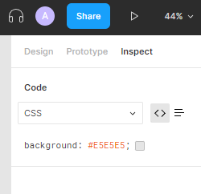

# Figma Docs 📖

This is a doc for using [Figma](https://www.figma.com/) effectively

    
<h5>
        Table of Contents 📚
        </h5>

        <ul>
<li>
<a href='#about'>About</a>

</li>
<li>
<a href='#overview'>Overview</a>

<ul>
<li><a href='#navbar'>Navbar</a></li>
<li><a href='#sidebar'>Sidebar</a></li>
<li><a href='#main-overview'>Main Overview</a></li>
</ul>
</li>
<li>
<a href='#figma-design'>Figma Design</a>

<ul>
<li>
<a href='#Header1'>Header</a>

</li>
<li>
<a href='#layer-manager'>Layer Manager</a>

</li>
<li>
<a href='#create-design'>Create Design</a>

</li>
<li>
<a href='#prototyping'>Prototyping</a>

<ul>
<li><a href='#micro-interactions'>Micro Interactions</a></li>
<li><a href='#interactions'>Interactions</a></li>
<li><a href='#flow'>Flow</a></li>
</ul>
</li>
<li>
<a href='#demo'>Demo</a>

</li>
<li>
<a href='#export'>Export</a>

</li>
</ul>
</li>
<li>
<a href='#figjam'>FigJam</a>

<ul>
<li><a href='#Header2'>Header</a></li>
<li><a href='#toolbar'>Toolbar</a></li>
<li><a href='#interactivity'>Interactivity</a></li>
<li><a href='#creating'>Creating</a></li>
</ul>
</li>
<li>
<a href='#sharingcollaborating'>Sharing/Collaborating</a>

</li>
<li>
<a href='#helpful-commands'>Helpful Commands</a>

</li>
<li>
<a href='#pricing'>Pricing</a>

</li>
<li>
<a href='#fonts'>Fonts</a>

</li>
<li>
<a href='#misc'>Misc</a>

</li>
<li>
<a href='#resources'>Resources</a>

</li>
<li>
<a href='#license'>License</a>

</li>
</ul>

<!---

* [About](#About)

* [Overview](#Overview)
  * [Navbar](#Navbar)
  * [Sidebar](#Sidebar)
  * [Main Overview](#Main Overview)
* [Figma Design](#Figma Design)
  * [Header](#Header1)
  * [Layer Manager](#Layer Manager)
  * [Create Design](#Create Design)
  * [Prototyping](#Prototyping)
    * [Interactions](#Interactions)
    * [Micro Interactions](#Micro Interactions)
    * [Flow](#Flow)
  * [Demo](#Demo)
  * [Export](#Export)
* [FigJam](#FigJam)
  * [Header](#Header2)
  * [Toolbar](#Toolbar)
  * [Interactivity](#Interactivity)
  * [Creating](#Creating)
* [Sharing/Collaborating](#Sharing/Collaborating)
* [Helpful Commands](#Helpful Commands)
* [Pricing](#Pricing)
* [Fonts](#Fonts)
* [Misc](#Misc)
* [Resources](#Resources)
* [License](#License)

-->

### About

Figma is a design platform that resembles that of Adobe Illustrator but is easy to share and collaborate. Figma has two main products, Figma Design file and FigJam file. The main file for UX/UI design will be with the design file while the FigJam is more for brainstorming. Currently as of writing, FigJam is in beta testing

## Overview

There are new FigJam templates but we will stick with a new blank project file to explore the documents from scratch. To start off, sign in or register for a figma account on [figma.com](https://www.figma.com/) landing screen by clicking on Log in or Sign up button on the top right (see below). 

**⚠ NOTE: if you are already logged in you will see the overview screen so you can skip this step**

Once you are in, you will be presented with the overview screen much like the one below. Of course yours may look slightly different.

#### Navbar

Starting from the top navigation bar going from left to right

| If you click your name or email it will open a dropdown to your account(s) | Search bar to search by files, teams or people | If you click on the bell  icon you will see notifications |
| ------------------------------------------------------------ | ---------------------------------------------- | ------------------------------------------------------------ |

If you click on you profile picture 

#### Sidebar

Moving on to the sidebar, you can see in order of top to bottom

* your recent files (will be default to this page)
* current drafts
* explore community templates and plugins
* advert to upgrade to figma
* a list of teams you are in or have created and the projects belonging to that team (ie for the above example (red) Team project is a project under my team Calgary heist)
* a button to create a new team

⚠ Note: a team can have multiple project which can contain multiple project files

##### Create new team

If you want to create a new team, click create team from above and follow the prompts

#### Main Overview

In you main overview (see above), we have options to (from top to bottom):

1. create a new design or FigJam file or import a figma file (a file with the .fig file extension)
2. select FigJam template for FigJam file (may have been removed by the time of viewing because FigJam is currently in Beta)
3. select recent project files with helpful widgets to help you find the files you want, ie a filter, sort by or list view 

## Figma Design

Figma design file is what most people know Figma for and will the the focus of this section. Assuming you created a new blank design file from the previous steps, you will be brought to a page that looks like the following:

We will explore this 1 piece at a time starting with the header strip

### Header

First let's name our FigJam file. This is done by clicking on the Untitled text in the header (red section below)

If you want to change the team or project is under, click on drafts and select a team/project or create a new team/project

If you click on the arrow in the red section (see above), you can

* see the version history much like the one found in Google Docs
* publish this project's styles and components
* export currently selected item
* duplicate current project file
* rename current project file (same as clicking on the project name text)
* move project to a different team (same as clicking the current project text (currently Jam Project))
* delete file

---

1. in the brown section of the header you will find a headphone icon if you've selected a team which will allow you to do a voice chat the the team assuming you have the feature enabled by having the Figma Professional tier
2. other collaborators (and yourself) that are currently viewing the file
3. share button to share a link for someone else to view or edit [see [#share](#share) for more info]
4. play button to enter into the first flow (see [#flow](#flow))
5. zoom level

---

In the blue section we have the Figma icon that opens the options (most of these options can also be accessed through the quick search - accessible by hitting <kbd>ctrl-p</kbd>) and the rest are tools we will be doing into more details in [Create Design](#Create Design)

Within the options, we have the options in order of top to bottom:

1. Back to [recent view](#Main Overview)

2. Quick action (command palette)

3. 

   * new files
   * place image (can also be done by dragging images in or using copy and paste from clipboard)
   * save current board (in a .fig file)
   * save current version as a named point so you can revert back to this named state later
   * view history of project
   * export selected
   * export all the frames/artboards

4. The rest of the options like Edit, View, Object, Vector, Text, and Arrange are basically useless as it can be quickly accessible using shortcuts or other places that are more convenient than going into this dialog box

5. 

   Plugin shows the plugins you currently have installed (these are global to your account) as well as the options to browse for other plugins

6. Integrations are usually tied to another 3rd party service like live embed in Confluence apps

7. 

   Preferences have a lot of useful options like snaps

8. User libraries (shared assets)

9. Get desktop app will redirect you to the download of the desktop app

10. Help and account has a bunch of miscellaneous features

### Layer Manager

#### Create

Figma works much like photoshop or illustrator where the canvas is laid out in artboards/frames. To create an artboard/frame click on the # icon in the header. Then in the left sidebar you will see a list of frames under the design tab (see below)

Expanding each one out, you will see different options for each, for example, of the 2 most common one - phone and desktop, select desktop and you will see a verity of options. I will pick MacBook 14". Once you click on it, a new artboard/frame will show up on the canvas

Your artboard will act as the base layer although you can have things outside of artboards. 

Alternatively once you # icon in the header, you can draw out a rectangle in the canvas to create a frame. 

If you drag or draw a frame in another frame, the new frame will most likely be a child of the parent frame. You can be certain of this if you look in the Layers tab in the left add see the same structure as below

Also note that frames can hold multiple frames and those frames inside can hold multiple frames and so on

#### Rename

If you want to rename a frame either double click on the frame's header text in the canvas or in the Layers outline

### Create Design

To start creating a design (UI part), using the the frame we created previously. First we will create a hero for the website

1. To create some header text hit the T icon on left in the header, then click on where you want to place it in the design
2. This will open up a textbox and you can start typing

✨**Tip**: If you want to add comments to your design for future reference or for your teammates, you can click on the bubble icon on the left part of the header

### Prototyping

Now we will get into interacting with the Figma file (the UX part)

#### Interactions

#### Micro Interactions

#### Flow

### Demo

Demos can be used to show potential stakeholders what screens are envisioned and how interactions will work. To enter into demo phase, click the play button on the right of the top header

After clicking on this, you will be launched into the interactive mode on a new window (this can then be shared with other people). Within the demo we can interact with the components we made in [#Interactions](#Interactions) 

---

#### Top

Within this screen we can see some options on the top and bottom bar. Let's start with the top portion

In this top portion we can:

* comment specifically on the mockup (this will be reflected in the design file) 
* share this prototyping site [see [#Sharing/Collaborating](#Sharing/Collaborating)]
* options -> is mostly useless options
* fullscreen

#### Bottom

In the bottom portion we can:

* change which frame we are on
* restart to the first flow/frame

#### Demo Video

### Export

To export a frame or whatever you have selected as svg, png, jpeg, or pdf, all that you want exported selected then go to Design->Export and select the export options

To export you project as .fig (Figma's proprietary file format) click on the Figma icon->File->Save local copy...

You can also export certain sections by using the slice tool under the same dropdown as frame in the header

## FigJam

🚧 **FigJam is currently in beta at the time of writing this** 🚧

FigJam are a more recent addition to figma.com and as stated previously, is mostly used for brainstorming ideas. There are many tools in a FigJam file that help in this process. First let's go through the UI layout

First thing to notice is you are open to a canvas with a tool bar at the bottom and a header strip.

### Header

First let's name our FigJam file. This is done by clicking on the Untitled text in the header (purple section below)

If you want to change the team or project is under, click on drafts and select a team/project or create a new team/project

If you click on the arrow in the purple section (see above), you can

* see the version history much like the one found in Google Docs
* duplicate current project file
* rename current project file (same as clicking on the project name text)
* move project to a different team (same as clicking the current project text (currently Jam Project))
* delete file

---

1. in the blue section of the header you will find a headphone icon if you've selected a team which will allow you to do a voice chat the the team assuming you have the feature enabled by having the Figma Professional tier
2. other collaborators (and yourself) that are currently viewing the file
3. share button to share a link for someone else to view or edit [see [#share](#share) for more info]
4. comments
5. reactions and timer [see [#interactivity](#interactivity)]
6. zoom level

### Toolbar

The tool bar contains (from left to right):

* mouse to select or hand to pan the canvas
* pencil to draw on the canvas (has option for highlighting as well)
* shapes - they act the same as stick notes
* sticky notes - basically a text box
* text box
* connector (to show flow of 1 idea to the next)
* stamps 
* other widgets, plugins, templates and more

These can be dragged onto the canvas to be placed or clicked to activate the tool and click on the canvas to instantiate an instance 

### Interactivity

Since FigJam is more for interacting and brainstorming, there are ways to communicate with your team members like emotes, reactions, text messages

In addition you can set a timer to your brainstorming

### Creating

Now we can get to creating! For this we will be creating the start to making strawberry jam 😋

1. first drag in a sticky note

2. in the image below you will see options from left to right to

   * change the color of the sticky note
   * change font style of the text (ie bold, strikethrough)
   * hyperlink
   * create list (bullet points)
   * font size
   * toggle if you see author of the sticky note

   

3. If you hover over any of the 4 sides of the sticky note u will get a plus icon. If you click and drag the icon you can create another sticky note with a arrow pointing to it

4. You can also get an arrow to attach to a sticky note by having two independent sticky notes and doing step 3 but drag the would be new sticky note to the already existing one (see below gif)

   

5. Chain these interactions together and you can achieve something like this:

   

Congrats on completing your first FigJam 🎉

Using these simple interaction and the simple building block you can do anything your brain can storm up!

## Sharing/Collaborating

To share your Figma file click on the blue share button on the header and it will being you to this popup.

Here you can invite people to view only or edit the file. Please note that by default anyone with the link can view it and you would need to click on **Anyone with the link** dropdown to change it to **Only people invited to this file**. Otherwise you can publish to the community using the second tab on the top ribbon or even embed the figma file as a widget (as HTML) by clicking on **Get embed code**

## Helpful commands

* The most helpful command is <kbd>ctrl-p</kbd> to access the quick search menu. Using this you can search for any action/feature you want to preform  instead of digging through the UI
* Zoom in and out by holding control and using the mouse wheel
* Pan the canvas by holding space and dragging 

## Pricing

Figma has **3 tiers** for both Figma and FigJam. 

1. Free tier - usually for groups of 2 or forever alone
2. Figma Professional - for regular teams and team libraries and private/shared projects
3. Figma Organization - enterprise edition with SSO and organization level libraries

⚠ Note for **STUDENTS OR EDUCATORS**, Figma profession is **FREE**

## Fonts

Figma has many fonts coming from Google fonts. If you have a custom font in mind with the font files (most likely ttf or otf file) you need to:

1. download the [Figma desktop](https://www.figma.com/downloads/) app to edit custom text (although you can view it in the browser version)
2. or download the font installer [here](https://www.figma.com/downloads/) and reload all Figma tabs

## Misc

* Figma files can be shared via a .fig file format by clicking on the Figma Icon and selecting file->Save local copy...
* Also note that Figma has a desktop version (probably an [electron](https://www.electronjs.org/) port of the website) for MacOS and Windows
* Figma is a pretty good alternative to Adobe Illustrator, in fact in some capacities it is more capable 
* If you are implementing the design of the Figma file, we can go to the Inspect tab of the design file to get the code of how it's visualized. Most useful will probably be the CSS but you can also see the Android or iOS versions of the design

## Resources

General Figma docs: https://help.figma.com/hc/en-us

Installing Fonts: https://help.figma.com/hc/en-us/articles/360039956894-Access-local-fonts-on-your-computer

Figma mirco interactions: https://www.youtube.com/watch?v=LnPEGhE90r4

Figma desktop: https://www.figma.com/downloads/

Pricing: https://www.figma.com/pricing/

[**🔝 Back to Top**](#top)

## License

This tutorial is under  

